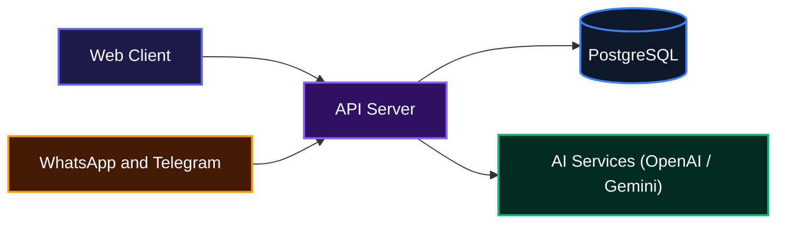
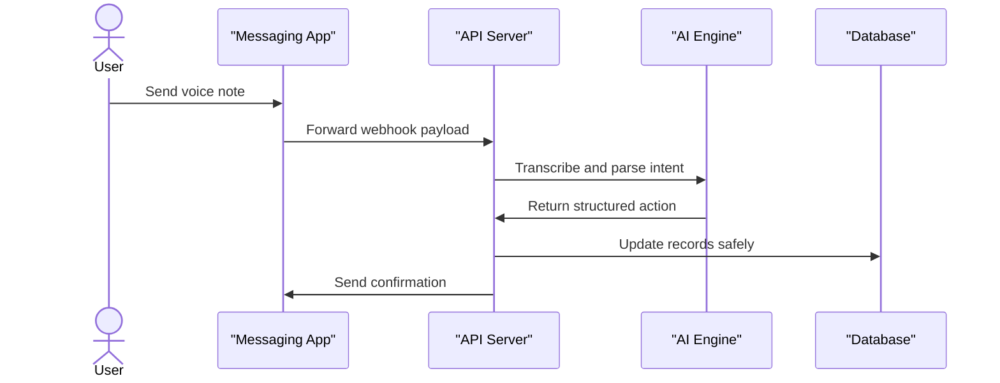
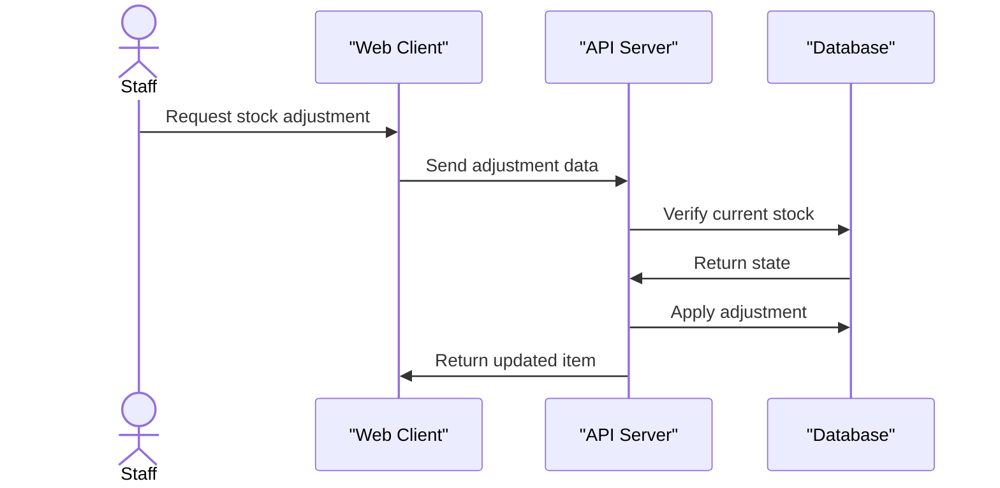

# Nomidat

A business management platform tailored for small and medium-sized enterprises, featuring conversational AI tracking for sales, expenses, and inventory through standard messaging applications.

## Project Overview

Nomidat helps business owners and teams manage their daily operations by tracking sales, inventory, and expenses using natural language. Users can record transactions and check balances simply by sending a text or voice note through familiar messaging apps. The system understands the context, updates stock, records payments, and generates invoices automatically, saving teams from tedious manual data entry. Conversational AI can use OpenAI or Gemini, while voice transcription can use Deepgram or Whisper.

## System Architecture



## Features

* **Conversational AI Management**
    Teams can interact with the system using natural English, Pidgin, or regional languages via Telegram and WhatsApp. The platform transcribes voice notes, extracts business intent, and automatically records sales or expenses.



* **Sales and Invoicing**
    Users can record sales, track customer balances, and apply partial payments. The system can automatically convert a completed sale into a formatted invoice and generate printable PDF receipts.

* **Inventory Control**
    Products are tracked with exact stock quantities and customizable low-stock thresholds. Inventory is adjusted dynamically when sales are recorded, preventing items from dropping below zero.



* **Organization and Team Access**
    The platform supports multi-tenant organizations with role-based access control. Owners can invite team members via email and assign specific roles to manage permissions securely.

## Installation

Follow these steps to set up the project locally.

1. Clone the Repository:

```bash
git clone https://github.com/Mbazu-Daniel/Nomidat.git
cd Nomidat
```

1. Install dependencies using pnpm:

```bash
pnpm install
```

1. Configure environment variables:

```bash
cp .env.example .env
```

Update the `.env` file with your database credentials, selected AI/transcription provider keys, and messaging platform tokens.

1. Start the required database services:

```bash
pnpm db:up
```

1. Run database migrations:

```bash
pnpm db:migrate
```

## Usage

Start the development server across the entire workspace:

```bash
pnpm dev
```

This command runs the API server, database studio, and web client concurrently. The API will be available on the port specified in your environment configuration. You can test incoming webhooks locally by configuring a tunneling service to forward Telegram or WhatsApp payloads directly to the webhook endpoints
## Author

* Daniel Mbazu -  <https://github.com/Mbazu-Daniel>
* Joy Ibini - <https://github.com/Nastechy>  

---
